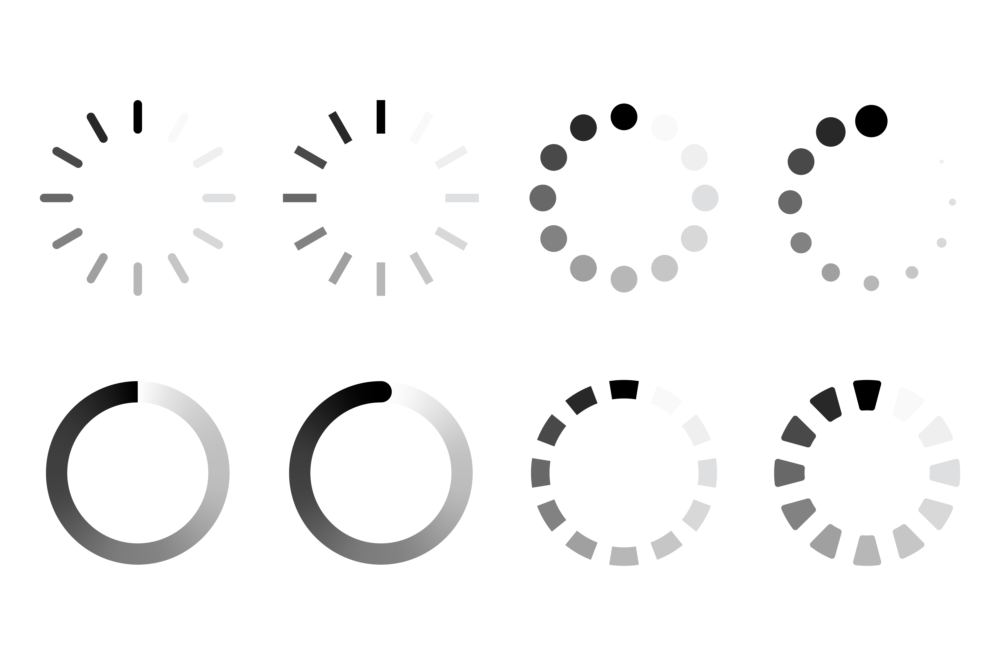

<!-- this is an html comment -->

 This is a comment in Liquid 

> ## Links
> * [CMSDAS at LPC2026](https://indico.cern.ch/event/1518299/)
> * [Github repo](https://github.com/FNALLPC/LongExerciseBsMuMu)
> * [Paper reference](https://cms-results.web.cern.ch/cms-results/public-results/publications/EXO-20-015/index.html)
> * [EXO-20-015 CADI page](https://cms.cern.ch/iCMS/analysisadmin/cadilines?id=2391&ancode=EXO-20-015&tp=an&line=EXO-20-015)
{: .callout}

> ## Prerequisites
>
> * [CMS DAS Pre-exercises](https://fnallpc.github.io/cms-das-pre-exercises/) 
> * [CMS DAS offline ROOT short exercise](https://cmsdas.github.io/root-short-exercise/)
> * [CMS Statistics short exercise](https://fnallpc.github.io/statistics-das/)
> * [CMS Pile-Up and Missing ET short exercise](https://garvitaa.github.io/METDAS/)
> * [CMS DAS offline event display short exercise](https://fnallpc.github.io/statistics-das/index.html)
{: .prereq}

### Goal of this exercise

To find new Physics.

The exercise is performed on data collected during Run 2. 

### Facilitators CMSDAS LPC 2026

 * [Chris Cosby](mailto:ccosby@fnal.gov) (FNAL)
 * Andrew Melo (Vanderbilt)
 * Gabriela Hamilton (U. Virginia)
 * Harshul Gupta (U. Illinois, Chicago)
 * Mohammad Abrar Wadud (U. Illinois, Chicago)

These instructions were created by [Kai-Feng Chen](mailto:Kai-Feng.Chen@cern.ch) and [Federica Riti](mailto:federica.riti@cern.ch) for CERN CMSDAS 2024, and are minorly augmented here to run on cmslpc for LPC CMSDAS 2026.  Big thanks and all credit to them for their hard work in creating and maintaining this exercise! 

This is an introduction to the exercise based on the recent publication on the measurement of $B_s^0 \to \mu^+\mu^-$ decay branching fraction and effective lifetime using the CMS Run-2 data sets (a.k.a. BMM5 analysis), see [BPH-21-006](http://cms-results.web.cern.ch/cms-results/public-results/publications/BPH-21-006/index.html) for details. In this exercise we will start with an introductory presentation, quickly touch the reconstruction of B meson using the standard tool from BPH group, and practice how to construct an unbinned maximum likelihood fitter to extract the decay branching fractions based on RooFit (the real main task!).

### Introductory slides

We will start with this introductory slides: [CMSDAS_BsMuMu.pdf](https://indico.cern.ch/event/1518299/contributions/6389314/attachments/3200567/5697675/BtoMuMu%20Exercise%202026%20LPC%20CMSDAS.pdf).

### Support

Join the [LongEX BsMuMU Mattermost channel](https://mattermost.web.cern.ch/cmsdaslpc2026/channels/longexbsmumu) and don't hesitate to ask for help from the facilitators in the room.


